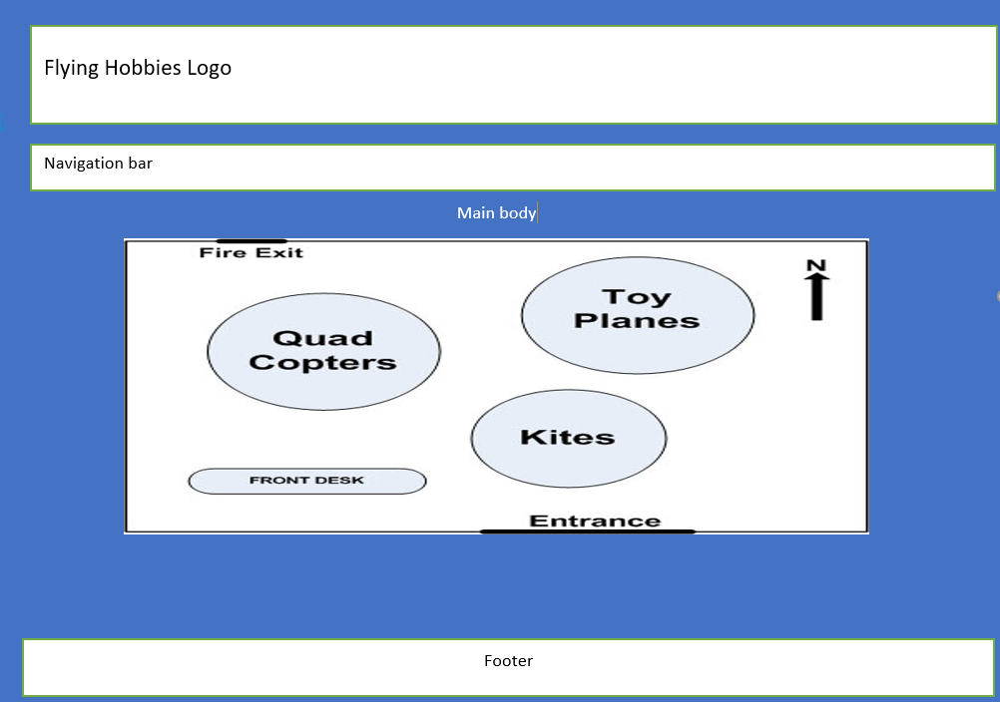
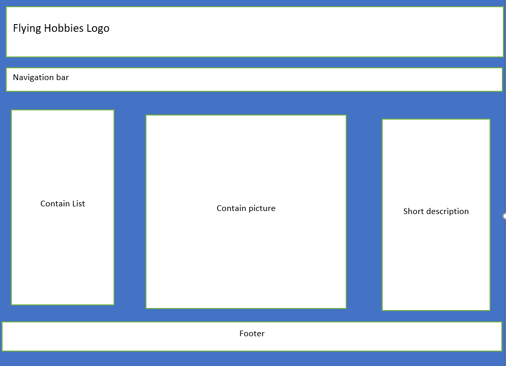
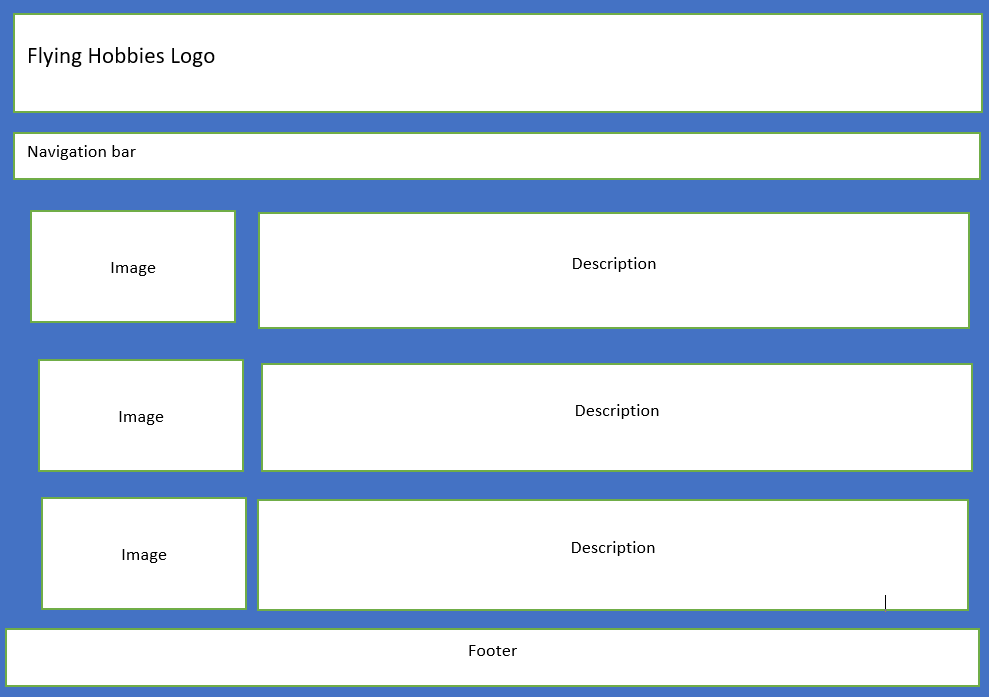
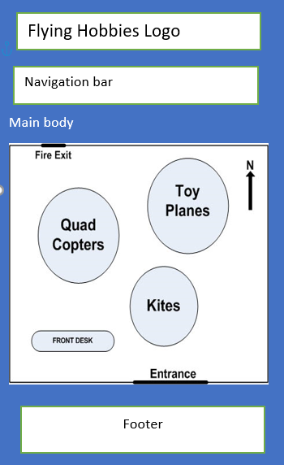
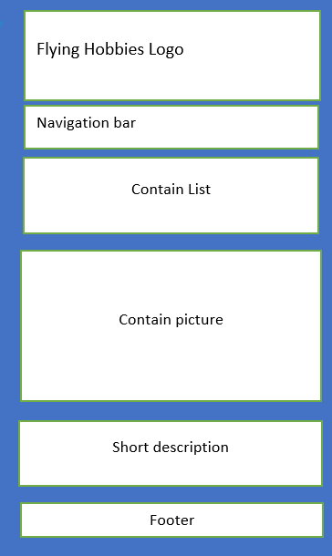
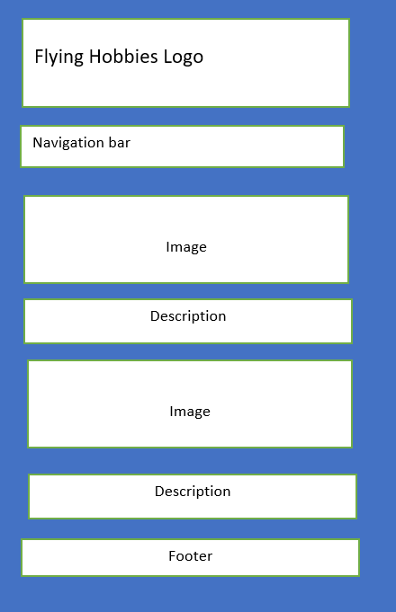

<h1>Portfolio 2.1 (Wireframe design) </h1>

<h2>2.1.1 Wireframe  </h2>
Wireframe is the basic way of showing a graphical representation of a website with its important elements. Wireframe helps to draw the layout structure with its main content.
  
<h2>2.1.2. Mockup </h2>
Mockup is the virtual way zthat represents the website. Here we have categorized mockup into two categories i.e Desktop mockup and mobile mockup
  
<h2>2.1.2.1 Desktop mockup  </h2>
This Desktop mockup is designed for the desktop with screen resolution  1280x1024 
  

<h3>2.1.2.1.1 Home page</h3>
  

     Fig: Mockup home page on screen resolution  1280x1024
     
     
<h3>
2.1.2.1.2 Content page
</h3>

<em>Fig: Mockup Content page on screen resolution  1280x1024</em>

<h3> 2.1.2.1.3 Content detail page </h3>

Fig: Mockup Content detail page on screen resolution  1280x1024

<h2>2.1.2.2 Mobile phone mockup</h2>

This Mobile phone mockup is designed for the desktop with screen resolution  360*640.

<h3>
2.2.2.2.2 Home page </h3>

Fig: Mockup home page on screen resolution 360*640

<h3>
2.2.2.2.2 Content page
</h3>

Fig: Mockup Content page on screen resolution 360*640

<h3>2.2.2.2.3 Content detail page</h3>

Fig: Mockup Content detail page on screen resolution 360*640

    
